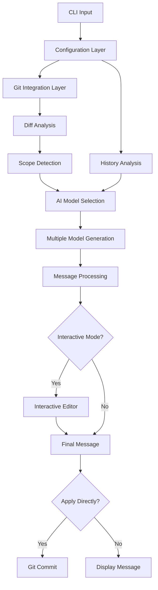

# New Feature Development for smart-committer

## Overview
smart-committer is an AI-powered CLI tool that automatically generates Git commit messages by analyzing code diffs using AI models such as Anthropic's Claude and OpenAI's GPT series. This document outlines proposed new features to enhance its functionality and user experience.

## Current Architecture
The application follows a modular architecture with these key components:
- CLI layer (command parsing via `commander`)
- Configuration layer (config file and environment variables)
- Git integration layer (via `simple-git`)
- AI model interaction layer (Anthropic and OpenAI SDKs)
- Output formatting and user interaction layer

## Proposed New Features

### 1. Commit Message History Analysis
**Description**: Allow the tool to analyze previous commit messages in the repository to learn and maintain consistent style and conventions.

**Implementation**:
- Add a new flag `--learn-history` to analyze previous commits
- Implement a scoring system to identify the most common commit patterns
- Store learned patterns in a local cache file
- Use historical patterns to influence message generation

**Benefits**:
- Better adherence to project-specific commit conventions
- Reduced need for custom prompts
- Improved consistency with team practices

### 2. Interactive Commit Message Editor
**Description**: Provide an interactive interface for users to refine AI-generated commit messages before committing.

**Implementation**:
- Add `--interactive` flag to enable interactive mode
- Display the AI-generated message with options to:
  - Accept as is
  - Edit manually
  - Regenerate with different parameters
  - Add a longer description body
- Use `inquirer` for the interactive prompts

**Benefits**:
- Gives users more control over the final commit message
- Allows for quick edits without regenerating
- Improves user confidence in the tool

### 3. Commit Scope Detection
**Description**: Automatically detect the scope of changes (e.g., which module, component, or file area was modified) and include it in conventional commit messages.

**Implementation**:
- Analyze file paths in the diff to determine the primary scope
- Implement pattern matching for common project structures (src/, components/, etc.)
- Add scope detection logic to the commit message generation process
- Include scope in conventional commit format (e.g., "feat(api): add new endpoint")

**Benefits**:
- More informative conventional commits
- Better integration with tools that parse commit scopes
- Reduced manual effort in specifying scope

### 4. Multi-Model Ensemble Generation
**Description**: Generate commit messages using multiple AI models simultaneously and either combine or let users choose the best one.

**Implementation**:
- Add `--ensemble` flag to enable multi-model generation
- Configure multiple models in the settings
- Run generation in parallel to minimize time overhead
- Present multiple options to the user or implement a voting/combination mechanism

**Benefits**:
- Higher quality commit messages through model diversity
- Reduced likelihood of poor quality from a single model
- More options for users to choose from

### 5. Commit Template System
**Description**: Allow users to define and use custom commit templates for different types of changes.

**Implementation**:
- Add a templates directory configuration
- Implement template parsing and variable substitution
- Add `--template <name>` flag to use specific templates
- Support variables like {{scope}}, {{type}}, {{description}}, etc.

**Benefits**:
- Greater customization for team-specific commit formats
- Consistency across different developers
- Support for complex commit message structures

### 6. Git Hook Enhancements
**Description**: Improve the Git hook integration with more configuration options and better error handling.

**Implementation**:
- Add configuration options for hook behavior
- Implement better error handling and fallback mechanisms
- Add option to automatically stage files before generating messages
- Support for different hook types (prepare-commit-msg, commit-msg, post-commit)

**Benefits**:
- More seamless integration with Git workflows
- Better error recovery
- More flexible automation options

### 7. Commit Statistics and Insights
**Description**: Provide analytics on commit patterns and suggestions for improvement.

**Implementation**:
- Add `--analyze` flag to generate commit statistics
- Track metrics like message length, style consistency, etc.
- Provide suggestions for improving commit quality
- Generate reports on team commit patterns

**Benefits**:
- Helps teams improve their commit practices
- Provides insights into project development patterns
- Can be used for retrospectives and process improvement

## Technical Implementation Plan

### Phase 1: Core Enhancements
1. Implement commit scope detection
2. Add interactive commit message editor
3. Enhance Git hook functionality

### Phase 2: Advanced Features
1. Develop commit message history analysis
2. Implement multi-model ensemble generation
3. Create commit template system

### Phase 3: Analytics and Insights
1. Build commit statistics and insights feature
2. Add reporting capabilities
3. Implement team-level analytics

## API Design Considerations

### New Configuration Options
```json
{
  "model": "claude-3-haiku-20240307",
  "style": "plain",
  "lang": "en",
  "diff": "staged",
  "type": "feat",
  "extraPrompt": "",
  "batch": false,
  "interactive": true,
  "learnHistory": true,
  "templatesDir": "./commit-templates",
  "hooks": {
    "autoStage": true,
    "fallbackMessage": "chore: auto-commit"
  }
}
```

### New CLI Options
| Option | Description |
|--------|-------------|
| `--interactive` | Enable interactive mode for refining commit messages |
| `--learn-history` | Analyze commit history to learn project conventions |
| `--template <name>` | Use a specific commit template |
| `--scope <scope>` | Specify the scope for conventional commits |
| `--analyze` | Generate commit statistics and insights |
| `--ensemble` | Use multiple AI models for generation |

## Data Flow Architecture



## Security and Privacy Considerations
- Ensure commit history analysis respects .gitignore patterns
- Implement proper caching of learned patterns with encryption options
- Add clear documentation about what data is sent to AI providers
- Provide offline mode options for sensitive repositories

## Performance Considerations
- Implement caching for commit history analysis to avoid repeated Git operations
- Use parallel processing for multi-model ensemble generation
- Optimize diff parsing for large repositories
- Add progress indicators for long-running operations

## Testing Strategy
1. Unit tests for new components (scope detection, template system, etc.)
2. Integration tests for CLI commands with new flags
3. Mock AI API responses for consistent testing
4. Test with various Git repository structures
5. Performance benchmarks for new features

## Dependencies and Requirements
- Existing dependencies will be extended but not replaced
- May require additional configuration files for templates
- Need to ensure backward compatibility with existing configurations
- Consider storage requirements for commit history cache